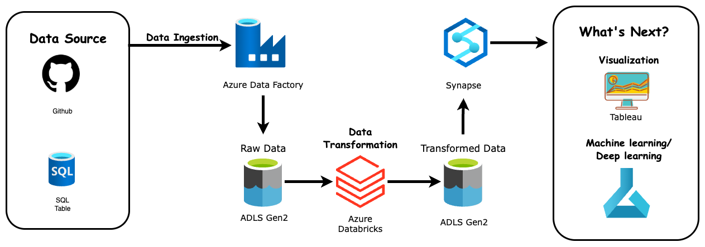
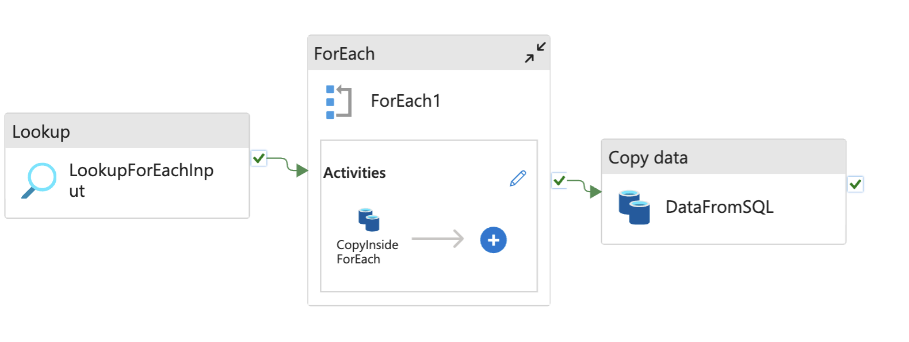

#  E-Commerce Data Pipeline (Azure ETL Project)


This project simulates a **production-grade end-to-end data pipeline** built on **Azure Data Services**, using the **Medallion Architecture** (Bronze → Silver → Gold). It transforms messy, fragmented e-commerce data into analytics-ready layers that support BI dashboards and machine learning workflows.

The pipeline ingests data from the [Brazilian E-Commerce Public Dataset by Olist](https://www.kaggle.com/datasets/olistbr/brazilian-ecommerce), which includes over 100,000 anonymized orders, covering customer behavior, product attributes, reviews, and shipping logistics.


## Architecture Overview



This pipeline follows a layered architecture with well-defined separation of concerns:

1. **Ingestion**: Raw data from CSV files is ingested using **Azure Data Factory** into **ADLS Gen2 (Bronze layer)**.
2. **Processing**: **Azure Databricks (PySpark)** transforms and joins datasets into the **Silver layer**.
3. **Enrichment**: External lookup data from **MongoDB** is merged to add business context (e.g., category names).
4. **Analytics**: The **Gold layer** is used by **Azure Synapse** and **Tableau** for BI and modeling purposes.


### What's next?

I believe this dataset opens the door to many exciting analytical possibilities. Here’s what I plan to build next:

- [ ] **Interactive KPI Dashboard** – Built with Tableau to monitor core business metrics.
- [x] **RFM Segmentation** – Using Recency, Frequency, and Monetary value to group customers via visualization and **unsupervised learning** algorithms.
- [ ] **Customer behavior** – Combining the [Marketing Funnel by Olist](https://www.kaggle.com/datasets/olistbr/marketing-funnel-olist) to analysis how to promote the business.

---

Stay tuned! This project is continuously evolving as I explore new ideas and techniques. 😊


## Data Ingestion: Raw Data to Bronze layer

The **Bronze layer** typically serves as the initial landing zone for data originating from external source systems. In this project, to better mimic a real-world scenario, data is sourced from **GitHub**, a **SQL Server**, and **MongoDB**.

To ingest data from GitHub and SQL Server, we use **Azure Data Factory (ADF)**, with the following pipeline:



This pipeline accesses the raw data URLs using a `ForEach` loop, where the source links are stored in a **JSON configuration file**. This setup makes future updates easier and more scalable.

While using such a pipeline to upload just a few small files might seem like overkill, the process helped me understand how to configure **linked services**, **datasets**, and **permissions** in Azure — which actually took quite a bit of time to get right!

However, imagine managing dozens of data sources or setting up a pipeline that runs daily — this structure quickly becomes not only necessary but powerful.


## Data Transformation: Bronze layer to Silver layer

The **Silver layer** is where raw data from the Bronze layer undergoes a series of transformation steps to reach a “just-enough” state — ready for analytics and business logic. It provides an integrated **enterprise view** of key entities, transactions, and relationships.

But what does “just-enough” really mean? It depends on the use case. Since I’m currently the sole user of this pipeline, and given the low cost of modern cloud storage, I choose to retain as much data as possible and defer heavier transformations until they’re actually needed.

All transformations are performed on **Azure Databricks using PySpark**, and the resulting data is stored in **ADLS Gen2 in `PARQUET` format** for optimized storage and query performance.


### Data Cleaning & Validation

- **Handle missing values**: Drop rows containing null from critical tables (e.g. `orders`, `order_items`) where necessary.

  ```python
  def clean_dataframe(df, name):
      print(f"Cleaning {name}")
      return df.dropDuplicates().na.drop('all')
  
  orders_df = clean_dataframe(orders_df, 'orders')
  items_df = clean_dataframe(items_df, 'order_items')
  ```

  For `review_df`, many rows contain nulls — which reflects a realistic business scenario where users often don’t leave reviews. These rows are preserved.


- **Remove duplicates**: Especially in `geolocation_df`, where the data is heavily duplicated due to anonymization.

  ```python
  total = geolocation_df.count()
  unique = geolocation_df.dropDuplicates().count()
  print(f"Total Rows: {total}")
  print(f"Duplicated Rows: {total - unique}")
  print(f"% of Duplication: {(total - unique) / total:.2%}")
  
  # Output:
  # Total Rows: 1000163
  # Duplicated Rows: 261831
  # % of Duplication: 26.18%
  ```

  Drop duplicates:

  ```python
  geolocation_df = geolocation_df.dropDuplicates()
  ```


- **Data type conversion**: For example, converting `order_delivered_customer_date` from timestamp to date:

  ```python
  orders_df = orders_df.withColumn(
      "order_delivered_customer_date", 
      to_date(col("order_delivered_customer_date"))
  )
  ```

- **Delivery Time Features**: To better analyze delivery performance, some features are created. For example:

  ```python
  orders_df = orders_df.withColumn("actual_delivery_time", 
                  datediff("order_delivered_customer_date", "order_purchase_timestamp"))
  ```
  


### Data conforming

Data from **MongoDB** has a different schema and structure. We convert it to a Spark DataFrame as follows:

```python
client = MongoClient(uri)
collection = client[database]['product_categories']

mongo_data = pd.DataFrame(list(collection.find()))
mongo_data.drop('_id', axis=1, inplace=True)
mongo_spark_df = spark.createDataFrame(mongo_data)
```


### Data matching for integration purpose

- **Join datasets**: All datasets (except `review_df`) are joined into `final_df`, resulting in a unified dataset with **37 features** and **118,434 rows** — ready for analytics or further processing.


## Data Serving: Silver layer to Gold layer

The **Gold layer** is the analytics-ready version of the data — cleaned, enriched, and structured for direct use in BI dashboards and machine learning models.

###  Initial Plan: Synapse (Failed... for now)

Originally, I intended to connect Azure Synapse to my **ADLS Gen2 Silver layer**, so that the data could be directly used in **Power BI**.

However, I encountered persistent access errors despite correctly configuring permissions (e.g., setting Synapse as a Contributor to the storage account):

```sql
CREATE SCHEMA gold;

CREATE VIEW gold.final AS
SELECT *
FROM OPENROWSET(
    BULK 'https://olistdatastoragelibei.dfs.core.windows.net/olistdata/silver/',
    FORMAT = 'PARQUET'
) AS result1;
```

Error message:

```sql
Content of directory on path 'https://olistdatastoragelibei.dfs.core.windows.net/olistdata/silver/' cannot be listed.
```

I tried everything I could find online (permissions, networking, identity...), but nothing worked.  
I'm currently contacting Microsoft support — if you’ve solved this before, please reach out!


### Plan B: PostgreSQL on Localhost

For now, I’ve exported the **Silver layer output** to **PostgreSQL** on my laptop and built the **Gold layer** there.

All queries are documented in the `.sql` files in this project. Here's a sample of what I did:

####  Create New Tables

To support time-based aggregations, I created a new table with extracted time features:

```sql
CREATE TABLE order_time AS
SELECT 
    order_id,
    customer_id,
    customer_unique_id,
    EXTRACT(YEAR FROM order_purchase_timestamp) AS y,
    EXTRACT(QUARTER FROM order_purchase_timestamp) AS q,
    EXTRACT(MONTH FROM order_purchase_timestamp) AS m,
    DATE(order_purchase_timestamp) AS d,
    EXTRACT(HOUR FROM order_purchase_timestamp) AS h
FROM olist_data
WHERE TO_CHAR(order_purchase_timestamp, 'YYYY-MM') 
      NOT IN ('2016-09', '2016-12', '2018-09', '2018-10');  -- outliers
```

> These four months contained only 25 rows, which seemed anomalous and were excluded.


#### Create Views for Business Use

Some views are created for Business Use. 

##### ``order_time_and_value``: Enabling KPIs like MAU, GMV, ARPU

```sql
CREATE VIEW order_time_and_value AS
SELECT
	a.order_id,
	a.customer_id,
	a.customer_unique_id,
	round(a.total_order_value::numeric, 2) as total_order_value,
	y,q,m,d,h
	FROM order_with_customer_summary a
	INNER JOIN order_time b
	ON a.order_id=b.order_id;
```
This view enables tracking key business metrics such as **Monthly Active Users (MAU)**
```sql
-- MAU
SELECT 
    TO_CHAR(d, 'YYYY-MM') AS month,
    COUNT(DISTINCT customer_unique_id) AS MAU
FROM order_time_and_value
GROUP BY TO_CHAR(d, 'YYYY-MM')
ORDER BY month;
```
With a simple visualization generated in **pgAdmin 4**, we can already begin to observe meaningful patterns in customer activity:


> Olist may be in trouble — growth appears to have stalled and may even be reversing. We'll explore this further in the upcoming analysis.


##### `rfm_scored`: Customer Segmentation via RFM

Views were created for **RFM analysis**, using quantile scoring:

  ```sq
  CREATE VIEW rfm_scored AS
  SELECT
  	customer_unique_id,
      recency,
  	frequency,
      monetary,
  
      -- scoring:
  	6 - NTILE(5) OVER (ORDER BY recency) AS r_score,   
  	NTILE(5) OVER (ORDER BY frequency) AS f_score,     
      NTILE(5) OVER (ORDER BY monetary) AS m_score       
  
  FROM rfm_base
  ```

 These views are designed to feed into future customer segmentation and marketing analysis.


## Governance & Access Control

A production-grade data pipeline isn’t just about transformation and delivery — it also requires thoughtful governance. In this project, access control is designed to reflect real-world data security practices, leveraging **Access Control (IAM)** in Azure and **Microsoft Entra ID** for identity management.

- **Bronze layer** access is restricted to ingestion users only.

-  **Silver and Gold layers** are accessible to BI and analytics teams.
-  Data stored in **Parquet format**, combined with **Synapse views**, lays the foundation for implementing **row-level security** in future stages.

This access model follows the principle of **least privilege**, ensuring that users and services only have access to the data they actually need.

