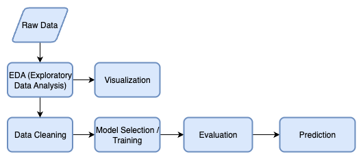
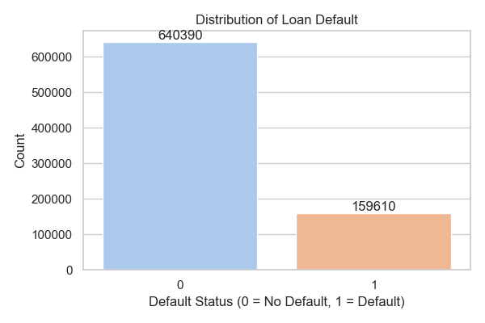
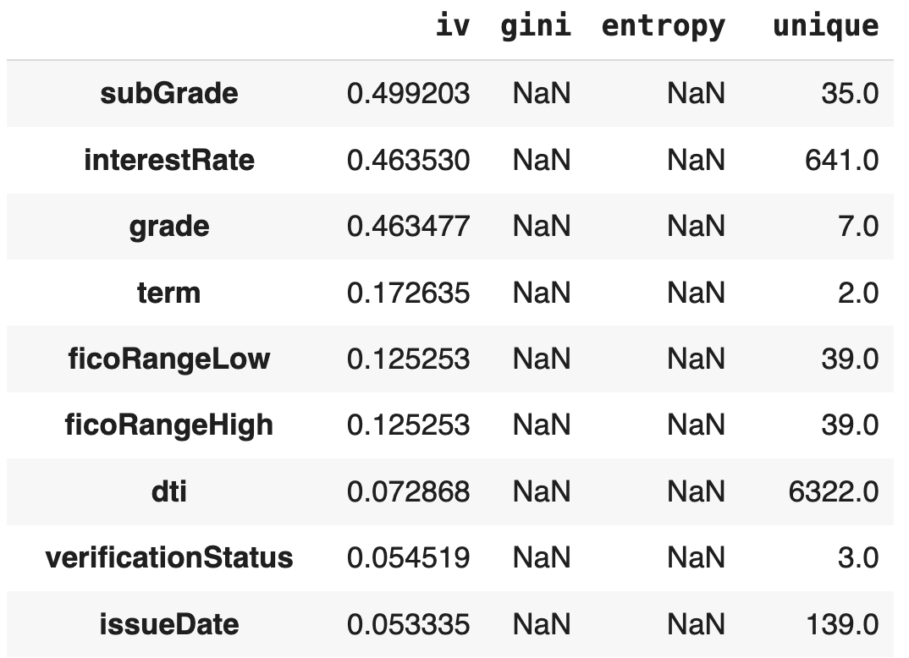
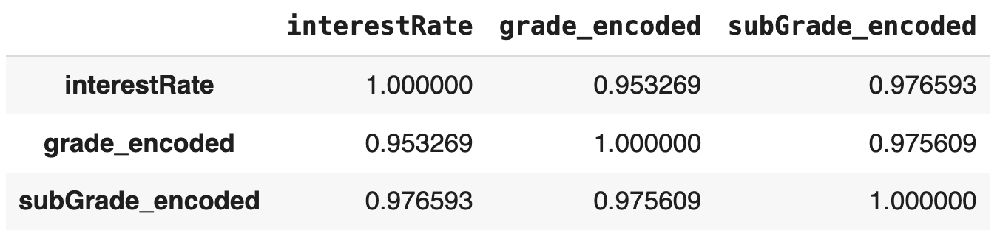
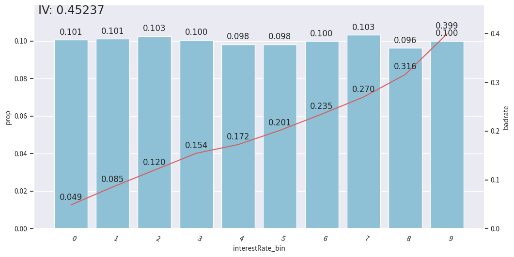
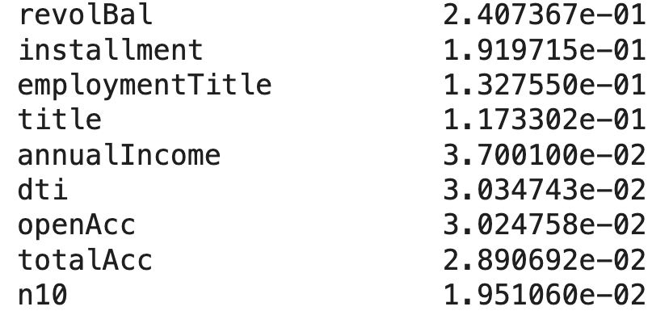
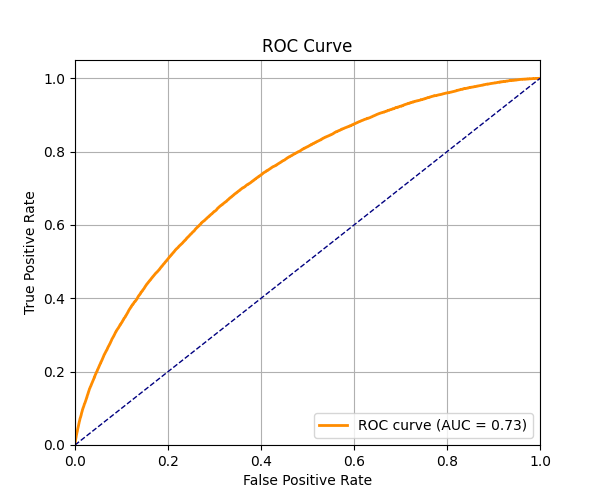
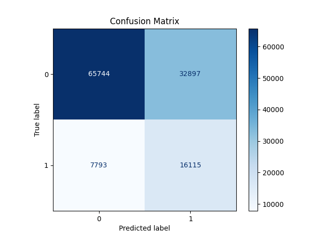

# Risk Management - Credit Default Prediction

> **Note**: This project is still in progress as I continue to learn and explore credit risk modeling.  
> Feel free to share your thoughts or reach out!

## Problem and Data
This project aims to predict whether a user will default on their loan.  
The dataset comes from a credit platform, containing over **1.2 million records** with **47 variables**, including **15 anonymous features**.

In real-world credit risk management, there are a few things worth keeping in mind:

### How do we choose a model?

- We're working with **imbalanced data**, which is actually a good sign  — most customers pay their loans!
  After all, if *everyone* defaulted, we’d have a much bigger problem than just modeling...
  
- We also care about **interpretability**. Credit scoring isn't just about prediction — it's about making decisions:  
  *Should we approve this loan? Should we ask for additional documents?*  
  An interpretable model helps risk officers, business teams, and even regulators understand *why* a decision was made.

For now, we've chosen **XGBoost**, which handles tabular data well, works with missing values, and can capture nonlinear interactions.  
(A full breakdown of this choice is on the way!)

### What metrics actually matter?

We can’t rely on **accuracy** alone. A model predicts “no one will default” will still reach 80% accuracy in this case. But it would be **completely useless**. And costly.

So what do we care about?

- **High recall**: We want to catch as many potential defaulters as possible.  
- **Balanced precision**: But we don’t want to falsely accuse too many good customers.

> Personally, I almost switched banks once because they wrongly flagged my account as risky — not a fun experience. So yes, precision matters too!

## EDA(Exploratory Data Analysis)

The target variable `isDefault` is **imbalanced**, which is typical in credit risk management scenarios.

In credit risk modeling, **Information Value (IV)** helps evaluate how predictive a variable is.  
We used the `toad` library to compute IVs, and found three variables with high predictive power.

A correlation analysis reveals that these high-IV features are **highly correlated** with each other:

## A Question Worth Asking...

> Are clients with higher interest rates more likely to default?

To explore this, we binned the `interestRate` feature and examined its relationship with the default rate:

It makes intuitive sense: clients with better credit scores tend to receive lower interest rates.  
But this raises a deeper question:

> **If we give high-risk clients even higher interest rates, does it actually reduce their likelihood of repaying?**

This is an interesting topic that deserves further investigation.

## Feature Engineering

The feature engineering includes 
- Variable binning
- Encoding
- Feature creation
- Feature selection via **Population Stability Index (PSI)**

We removed unstable features to avoid customer loss due to model drift or unstable scoring.

## Model Training and Evaluation

### Model Selection
We chose XGBoost as the final model for its strong performance on tabular data and ability to handle feature interactions. A more detailed explanation is coming soon.

### Model Training: Colab vs. Azure?
During this project, I experimented with both **Azure Notebooks** and **Google Colab** — mainly because my poor MacBook Air just isn’t built for this kind of workload.

The code in this repository is based on the **Google Drive + Colab** setup, which you’ll notice from the `mount drive` snippet at the beginning.

Here’s my take:

- **Azure** is powerful and well-integrated, but not free.  
- **Colab**, on the other hand, is free and surprisingly capable — but with a catch:  
  If you close the tab or get disconnected, you risk losing progress.

To mitigate this, I use the `callbacks` parameter in XGBoost to automatically save the model every 50 rounds.  
These checkpoints are saved in the `risk_checkpoint` folder on Google Drive, so I can recover my progress even after unexpected interruptions.

### Model Evaluation
Model performance is visualized using:

- **ROC Curve (AUC)**  
- **Confusion Matrix**

The **ROC curve** illustrates the trade-off between the true positive rate (recall) and false positive rate across thresholds.  
A high **AUC** score suggests that the model effectively distinguishes between users who default and those who don't.

The **confusion matrix** provides detailed insight into how the model performs across different prediction outcomes.

Ideally, we want more **true positives (TP, top-left)** and **true negatives (TN, bottom-right)** — correctly identifying both defaulters and reliable borrowers.

At the same time, we aim to strike a balance between **precision** and **recall**:
- Misclassifying a reliable customer as a defaulter (false positive) may lead to losing good clients.
- Missing a true defaulter (false negative) can result in significant financial loss.

This trade-off is critical in real-world credit risk management.

## Summary 

This project walks through the entire credit risk modeling pipeline — from data exploration and feature engineering to model evaluation — and asks critical, data-driven questions along the way.

It also reflects an ongoing process of learning and thinking: not just **how** to model credit risk, but also **why** certain patterns appear in the data — and what that means for real-world decision making.

## What's in the future?
- Create more features and find the useful and explainable ones
- Try more models like lightGBM/catboost
- Combine multiple models to make better prediction
