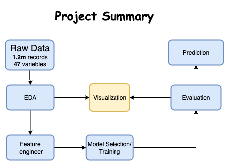

# Risk Management - Credit Default Prediction

## Project and Data detail
This project aims to predict weather a user's loan will default. The data comes from the loan records of a certain credit platform. The total data volume exceeds 1.2 million, including 47 columns of variable information, of which 15 columns are anonymous variables.
